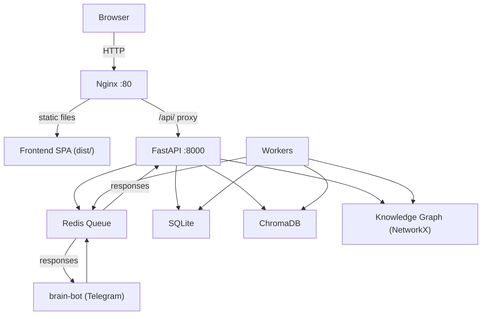

# Brain Bot Web Interface

A full-featured React + FastAPI web interface for the Brain Bot second-brain assistant. Provides a browser-based dashboard with chat, knowledge management, task tracking, journal viewing, knowledge graph visualization, and system monitoring -- all backed by the same Redis queue, SQLite, and ChromaDB databases used by the Telegram bot.

## Architecture



**Request flow:** The browser loads the React SPA from Nginx. All API calls go to `/api/*`, which Nginx reverse-proxies to the FastAPI backend on port 8000. The backend pushes user messages into the shared Redis queue. Workers (shared with the Telegram bot) pick up jobs, run the appropriate agent, and post responses back through Redis. The frontend polls for responses every 2 seconds.

## Tech Stack

| Layer    | Technology                                                          |
|----------|---------------------------------------------------------------------|
| Frontend | React 18, Vite 6, axios, @chatscope/chat-ui-kit-react, react-force-graph-2d, react-markdown |
| Backend  | FastAPI, uvicorn, PyJWT, bcrypt, redis                              |
| Proxy    | Nginx (port 80, reverse proxy + SPA routing)                       |
| Process  | PM2 (process name: `brain-web-api`)                                |
| Shared   | Redis queue, SQLite, ChromaDB, NetworkX knowledge graph            |

## Project Structure

```
brain-web-interface/
├── backend/
│   ├── main.py           # FastAPI server (~729 lines)
│   ├── start.sh          # PM2 startup script
│   ├── requirements.txt
│   ├── .env.example
│   └── users.json        # User credentials (auto-created on first login)
├── frontend/
│   ├── src/
│   │   ├── api.js        # Shared axios instance with auth interceptor
│   │   ├── App.jsx       # Main app with sidebar navigation
│   │   ├── components/   # 10 React components
│   │   └── styles/       # 10 CSS files (one per component)
│   ├── dist/             # Production build (served by Nginx)
│   ├── package.json
│   └── vite.config.js
├── nginx/
│   └── brain-bot.conf    # Reverse proxy + SPA fallback routing
└── README.md
```

## Frontend Components

The interface is organized into 10 components, accessible via a sidebar navigation.

### 1. Login.jsx

Authentication form. Submits credentials to `/auth/login` and stores the JWT token. On 401/403 responses the auth interceptor in `api.js` automatically logs the user out.

### 2. ForcePasswordChange.jsx

Shown when the user is still using default credentials. Requires setting a new password before any other page is accessible.

### 3. Dashboard.jsx

Overview page with aggregated stats from a single `/dashboard/overview` call:
- Knowledge entry count
- Pending tasks
- Journal streak (consecutive days)
- Knowledge graph node count
- Redis queue length
- Worker health status
- Top tags
- Recent activity feed

### 4. Chat.jsx

Full chat interface built on `@chatscope/chat-ui-kit-react`. Features:
- Agent selector dropdown: auto, researcher, archivist, coder, writer, journal, task_manager
- Markdown rendering via `react-markdown`
- Real-time polling every 2 seconds for bot responses
- Conversation history

### 5. Tasks.jsx

Task management with full CRUD:
- Create tasks with title, due date, priority, and tags
- Priority indicated by color coding
- Filter by status: pending, completed, all
- Mark complete or delete inline

### 6. Journal.jsx

Journal entry viewer:
- Entries grouped by date
- Mood indicated by color
- Voice entries marked with a badge
- Date range filtering

### 7. GraphView.jsx

Interactive knowledge graph visualization using `react-force-graph-2d`:
- Nodes colored by type
- Click a node to see details
- Side panel showing related nodes and backlinks

### 8. KnowledgeBase.jsx

Search and browse all stored knowledge:
- Full-text search
- Advanced filters: tags, date range, content type, source
- Entry detail modal with full content display

### 9. Monitor.jsx

System health dashboard with 5-second auto-refresh:
- Queue depth, Redis status, knowledge count
- PM2 process cards with uptime and memory
- Activity log
- Error log

### 10. Settings.jsx

Password change form.

## API Endpoints

All endpoints are served under `/api/` via Nginx proxy. Authentication is required for all endpoints except `/auth/login` and `/health`.

### Authentication

| Method | Path                  | Description                     |
|--------|-----------------------|---------------------------------|
| POST   | /auth/login           | Authenticate and receive JWT    |
| POST   | /auth/change-password | Change the current user password|

### Messages

| Method | Path               | Description                              |
|--------|--------------------|------------------------------------------|
| POST   | /messages/send     | Send a message to the bot via Redis queue|
| GET    | /messages/history  | Retrieve conversation history            |
| GET    | /messages/pending  | Poll for pending bot responses           |

### Knowledge

| Method | Path                | Description                      |
|--------|---------------------|----------------------------------|
| GET    | /knowledge/stats    | Knowledge base statistics        |
| GET    | /knowledge/entries  | List/browse entries with filters |
| GET    | /knowledge/search   | Search entries by query          |

### Dashboard

| Method | Path                 | Description                          |
|--------|----------------------|--------------------------------------|
| GET    | /dashboard/overview  | Aggregated stats in a single call    |

### Tasks

| Method | Path                     | Description            |
|--------|--------------------------|------------------------|
| GET    | /tasks                   | List tasks with filters|
| POST   | /tasks                   | Create a new task      |
| POST   | /tasks/{id}/complete     | Mark a task complete   |
| DELETE | /tasks/{id}              | Delete a task          |

### Journal

| Method | Path      | Description                          |
|--------|-----------|--------------------------------------|
| GET    | /journal  | List journal entries with date range |

### Knowledge Graph

| Method | Path              | Description                     |
|--------|-------------------|---------------------------------|
| GET    | /graph/stats      | Graph node/edge counts          |
| GET    | /graph/data       | Full graph data for rendering   |
| GET    | /graph/node/{id}  | Node details with relationships |

### System Monitor

| Method | Path                | Description                    |
|--------|---------------------|--------------------------------|
| GET    | /monitor/stats      | Queue, Redis, knowledge counts |
| GET    | /monitor/activity   | Recent activity log            |
| GET    | /monitor/queue      | Current queue contents         |
| GET    | /monitor/processes  | PM2 process status             |
| GET    | /monitor/errors     | Recent error log               |

### Health

| Method | Path    | Description       |
|--------|---------|-------------------|
| GET    | /health | Health check      |

## Setup

### Prerequisites

- Python 3.10+
- Node.js 18+
- Redis server running locally
- Nginx installed
- PM2 installed globally (`npm install -g pm2`)
- The main `assistant-brain-os` project configured with its SQLite and ChromaDB databases

### Backend

```bash
cd /root/brain-web-interface/backend
python3 -m venv venv
source venv/bin/activate
pip install -r requirements.txt
cp .env.example .env
# Edit .env with your JWT_SECRET_KEY and REDIS_URL
```

### Frontend

```bash
cd /root/brain-web-interface/frontend
npm install
npm run build    # outputs to dist/
```

### Nginx

Copy or symlink the provided config and reload:

```bash
sudo ln -sf /root/brain-web-interface/nginx/brain-bot.conf /etc/nginx/sites-enabled/
sudo nginx -t && sudo systemctl reload nginx
```

### Running

**Production (PM2):**

```bash
cd /root/brain-web-interface/backend
pm2 start start.sh --name brain-web-api
pm2 save
```

Nginx serves the frontend from `frontend/dist/` and proxies `/api/` to the FastAPI backend on port 8000.

**Development:**

```bash
# Backend (with reload)
cd /root/brain-web-interface/backend
source venv/bin/activate
uvicorn main:app --reload --port 8000

# Frontend (Vite dev server)
cd /root/brain-web-interface/frontend
npm run dev
```

## Authentication

- JWT tokens issued on login, sent as `Authorization: Bearer <token>` headers.
- Passwords hashed with bcrypt and stored in `backend/users.json` (auto-created).
- The axios interceptor in `api.js` catches 401/403 responses and redirects to login.
- On first login with default credentials, `ForcePasswordChange` requires a new password.

**Default credentials:**

```
Username: admin
Password: Y8gQScZIAZ0EHCM3
```

The interface forces a password change on first login.

## Security

- JWT authentication on all protected endpoints
- bcrypt password hashing
- CORS protection
- Auto-logout on expired or invalid tokens
- Nginx handles TLS termination (configure with Let's Encrypt for production)

## Monitoring and Logs

```bash
# Backend process
pm2 status brain-web-api
pm2 logs brain-web-api

# Nginx logs
tail -f /var/log/nginx/brain-bot-access.log
tail -f /var/log/nginx/brain-bot-error.log

# Health check
curl http://localhost:8000/health
```

The in-app Monitor page provides real-time visibility into queue depth, worker status, PM2 processes, and recent errors without needing shell access.

## Troubleshooting

**Cannot log in:** Verify the backend is running (`curl http://localhost:8000/health`). Check `pm2 logs brain-web-api` for errors.

**Messages not returning:** Confirm Redis is reachable (`redis-cli ping`). Confirm the brain-bot workers are running (`pm2 list`). The Chat component polls `/messages/pending` every 2 seconds -- if the worker is down, messages will sit in the queue.

**Graph not loading:** The `/graph/data` endpoint reads from the NetworkX knowledge graph. If the graph file does not exist yet, the endpoint returns empty data. Add knowledge through the bot first.

**Frontend changes not appearing:** Rebuild with `npm run build` in the frontend directory, then hard-refresh the browser. Nginx serves from `dist/`.

## License

Same license as the Brain Bot project.
